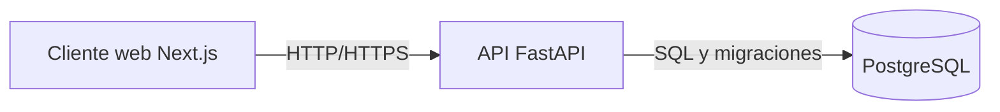

# Arquitectura preliminar del proyecto

## 1. Estructura de carpetas

```text
proyecto-software-agil/
├── backend/              # API FastAPI (Python)
│   ├── app/
│   └── tests/
├── frontend/             # Interfaz Next.js
│   └── src/
├── docs/                 # Documentacion del proyecto
│   ├── arquitectura.md
│   ├── comparativa.md
│   └── manifiesto.md
├── .gitignore
└── README.md
```

Los archivos `.gitkeep` mantienen las carpetas preparadas en Git hasta que se incorporen los primeros módulos de código.

## 2. Flujo de arquitectura



El frontend Next.js presenta la interfaz y consume la API. FastAPI concentra las reglas de negocio y expone endpoints HTTP. PostgreSQL persiste usuarios, productos, pedidos y el resto de la información del sistema.

## 3. Beneficios para un enfoque ágil

### Separación por capas

El frontend, la API y la base de datos tienen responsabilidades separadas. Se puede cambiar el diseño web sin reescribir la lógica de negocio, siempre que se conserve el contrato de la API.

### Entregas incrementales

El equipo puede construir y probar una funcionalidad vertical completa en cada sprint: primero catálogo de productos, después usuarios y luego ventas. Cada incremento demuestra valor real.

### Adaptación rápida

Si cambia un requisito, se ajustan los endpoints y la interfaz en el siguiente sprint. La separación reduce el impacto y evita rehacer toda la planificación del sistema.

### Pruebas continuas

La API puede probarse con pruebas unitarias y de integración, mientras el frontend valida sus componentes y flujos. La retroalimentación llega durante el desarrollo, no solo al final.

### Menor riesgo

Si una funcionalidad se cancela o cambia, las demás capas y funcionalidades pueden seguir funcionando. Los incrementos pequeños hacen visibles antes los problemas técnicos y de producto.

## 4. Relación con la metodología

Esta arquitectura se beneficia más de un enfoque ágil que de Cascada porque permite cambiar una parte del producto, entregar funcionalidades pequeñas y obtener retroalimentación temprana. Cascada sigue siendo útil para requisitos estables o regulados, pero en este proyecto de comercio electrónico la evolución del mercado hace más valioso aprender y ajustar en ciclos cortos.
